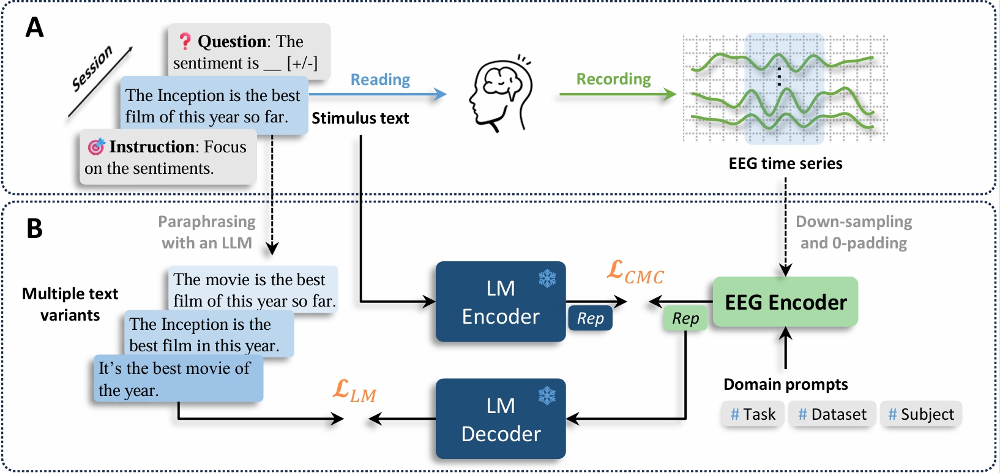
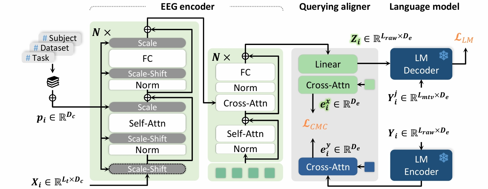

## GLIM:  Learning Interpretable Representations Leads to Semantically Faithful EEG-to-Text Generation<br><sub>Official PyTorch Implementation</sub>

This repository contains:

* ⚡ A modular [implementation](model/glim.py) of GLIM, organized with PyTorch Lightning.
* ✂️ Complete data [preprocessing](data/__STEP1_text_extract_revise.ipynb) notebooks.
* 🚆 Simple [training](train.py) and [test](test.py) scripts.
* 🧭 Semantic [classification](predict_corpus.ipynb) notebooks that align with the results shown in paper.
* 🗒️ All text samples generated by [GLIM](results/wandb_export_gen_samples_glim.csv), its [noise-input test](results/wandb_export_gen_samples_noise_input_test.csv) and [prompt-free test](results/wandb_export_gen_samples_prompt_free_test.csv).

More resources available:

* 📍 Model checkpoint of GLIM at [figshare](https://figshare.com/articles/preprint/glim-zuco-epoch_199-step_49600_ckpt/29115161).
* 📋 Full generated samples in an interactive [wandb report](https://wandb.ai/mind-reading/glim-iclr/reports/GLIM-generation-samples--VmlldzoxMjc0Njg1NQ?accessToken=5uqxxv6ug80naqfqlni2xvxa8y8l7u6ouc1cgjt0naxk1g8g0h9lgyf8r0e97xyk).

### Abstract

  

Pretrained generative models have opened new frontiers in brain decoding by enabling the synthesis of realistic texts and images from non-invasive brain recordings. However, the reliability of such outputs remains questionable—whether they truly reflect semantic activation in the brain, or are merely hallucinated by the powerful generative models. 
In this paper, we focus on EEG-to-text decoding and address its hallucination issue through the lens of posterior collapse. Acknowledging the underlying mismatch in information capacity between EEG and text, we reframe the decoding task as semantic summarization of core meanings rather than previously verbatim reconstruction of stimulus texts. 
To this end, we propose the Generative Language Inspection Model (GLIM), which emphasizes learning informative and interpretable EEG representations to improve semantic grounding under heterogeneous and small-scale data conditions. 
Experiments on the public ZuCo dataset demonstrate that GLIM consistently generates fluent, EEG-grounded sentences without teacher forcing. Moreover, it supports more robust evaluation beyond text similarity, through EEG-text retrieval and zero-shot semantic classification across sentiment categories, relation types, and corpus topics. Together, our architecture and evaluation protocols lay the foundation for reliable and scalable benchmarking in generative brain decoding.

### Model architecture
  


### Representative generation examples
  

You can find full samples in [`.results/wandb_export_gen_samples_glim.csv`](results/wandb_export_gen_samples_glim.csv).

## Setup
- Run `conda env create -f environment.yml` to create environment.
- Download the ZuCo dataset, including its version [1.0](https://osf.io/q3zws/) and [2.0](https://osf.io/2urht/). 

  <details>
  <summary>You can just download part of the dirs and organize them as the following structure.</summary>

  ```
  --/data
    --📂raw_data
      --📂ZuCo1
      --📥task_materials
        --📂task1- SR
          --📥Matlab files
        --📂task2 - NR
          --📥Matlab files
        --📂task3 - TSR
          --📥Matlab files
      --📂ZuCo2
        --📥task_materials
        --📂task1 - NR
          --📥Matlab files
        --📂task2 - TSR
          --📥Matlab files
  ```

  </details>

## Data preprocessing
You can either  
  - run all 4 preprocessing notebooks step-by-step; or just 
  - start from [STEP3](data/__STEP3_eeg_preproc.ipynb) with this [label table](data/tmp/zuco_label_8variants.df) to skip the generation of text variants.

## Reproduce our results
- Download the [model checkpoint](https://figshare.com/articles/preprint/glim-zuco-epoch_199-step_49600_ckpt/29115161) and put it in [`.checkpoints/`](checkpoints/).
- Run [`test.py`](test.py) to generate sentences and compute overall metrics, with one single GPU.
- Run each `predict_xxx.ipynb` to reproduce the classification results (after prompt engineering).

## Train from scratch
- Run [`train.py`](train.py) with default parameters (except for those assosiated with your devices).

## License
⚖️ GLIM © 2025 by this repository owner is licensed under [CC BY-NC-SA 4.0](https://creativecommons.org/licenses/by-nc-sa/4.0/).


